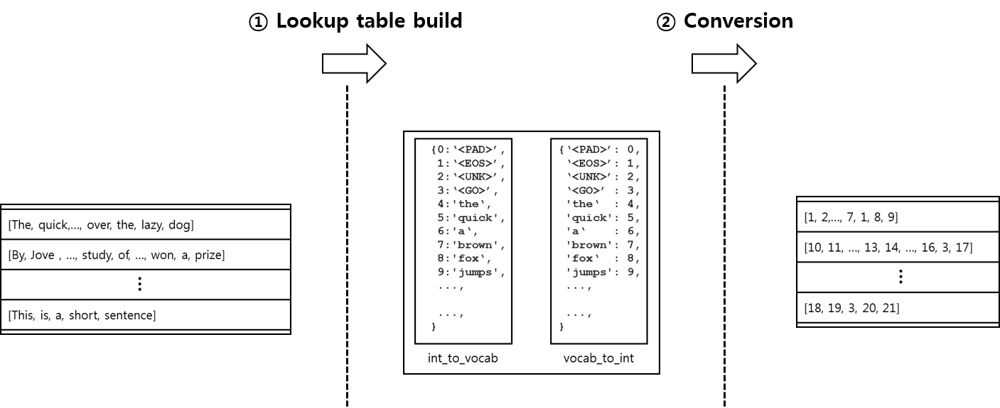
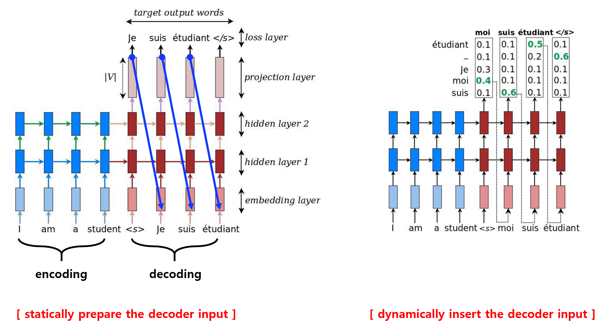
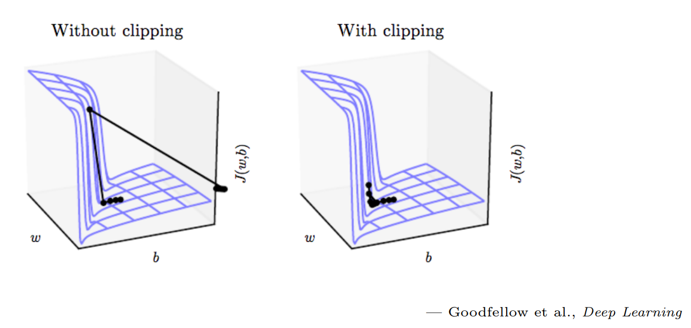

# MLT (EN to FR ) TensorFlow

In this project, I am going to build language translation model called `seq2seq model or encoder-decoder model` in TensorFlow. The objective of the model is translating English sentences to French sentences. I am going to show the detailed steps, and they will answer to the questions like `how to preprocess the dataset`, `how to define inputs`, `how to define encoder model`, `how to define decoder model`, `how to build the entire seq2seq model`, `how to calculate the loss and clip gradients`, and `how to train and get prediction`. Please open the IPython notebook file to see the full workflow and detailed descriptions.

This is a part of Udacity's Deep Learning Nanodegree. Some codes/functions (save, load, measuring accuracy, etc) are provided by Udacity. However, majority part is implemented by myself along with much richer explanations and references on each section.

You can find only the model part explained in my medium post. https://medium.com/@parkchansung/seq2seq-model-in-tensorflow-ec0c557e560f

# Brief Overview of the Contents
### Data preprocessing
In this section, you will see how to get the data, how to create `lookup table`, and how to `convert raw text to index based array` with the lookup table.

  

### Build model
In short, this section will show how to `define the Seq2Seq model in TensorFlow`. The below steps (implementation) will be covered.
- __(1)__ define input parameters to the encoder model
  - `enc_dec_model_inputs`
- __(2)__ build encoder model
  - `encoding_layer`
- __(3)__ define input parameters to the decoder model
  - `enc_dec_model_inputs`, `process_decoder_input`, `decoding_layer`
- __(4)__ build decoder model for training
  - `decoding_layer_train`
- __(5)__ build decoder model for inference
  - `decoding_layer_infer`
- __(6)__ put (4) and (5) together
  - `decoding_layer`
- __(7)__ connect encoder and decoder models
  - `seq2seq_model`
- __(8)__ train and estimate loss and accuracy

  

### Training
This section is about putting previously defined functions together to `build an actual instance of the model`. Furthermore, it will show how to `define cost function`, how to `apply optimizer` to the cost function, and how to modify the value of the gradients in the TensorFlow's optimizer module to perform `gradient clipping`.

  

### Prediction
Nothing special but showing the prediction result.
